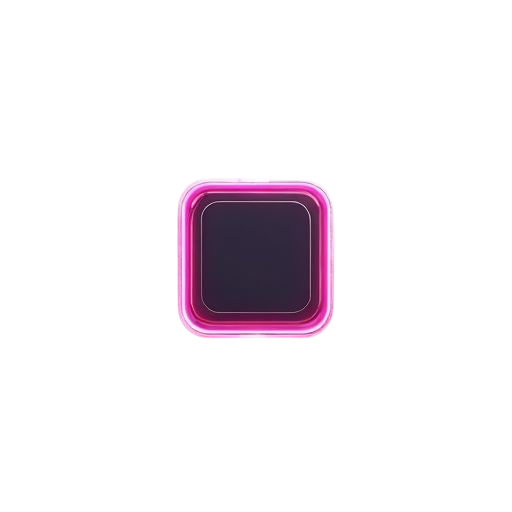
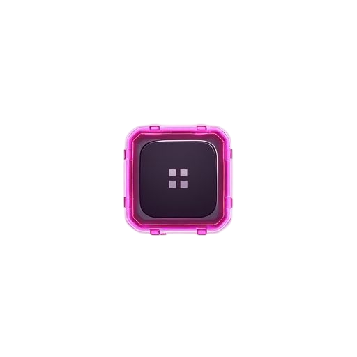
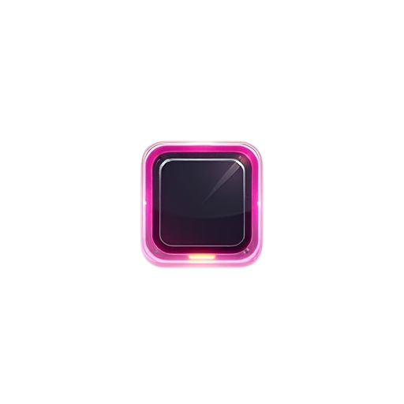

# UI Button Generation Report

**Generated**: 1/25/2026, 10:35:59 AM  
**Theme**: cyberpunk neon with glowing edges and holographic effects  
**Component**: button  
**States**: normal, hover, pressed  
**Resolution**: 256x256  
**Nine-Patch Margins**: 12px all sides

---

## Generation Summary

✅ **3/3 states generated successfully**

- ✅ normal
- ✅ hover
- ✅ pressed

---

## Prompts

### Normal State

<details>
<summary><strong>Prompt</strong> (317 chars)</summary>

```
A button UI background for a game interface. Theme: cyberpunk neon with glowing edges and holographic effects. State: neutral, clean. Front view, flat 2D element with transparent background. Decorative borders and clean center area suitable for nine-patch scaling. Professional game UI style, functional and thematic.
```

</details>

### Hover State

<details>
<summary><strong>Prompt</strong> (333 chars)</summary>

```
A button UI background for a game interface. Theme: cyberpunk neon with glowing edges and holographic effects. State: highlighted, slightly brighter. Front view, flat 2D element with transparent background. Decorative borders and clean center area suitable for nine-patch scaling. Professional game UI style, functional and thematic.
```

</details>

### Pressed State

<details>
<summary><strong>Prompt</strong> (329 chars)</summary>

```
A button UI background for a game interface. Theme: cyberpunk neon with glowing edges and holographic effects. State: depressed, darker or inset. Front view, flat 2D element with transparent background. Decorative borders and clean center area suitable for nine-patch scaling. Professional game UI style, functional and thematic.
```

</details>

---

## Generated Images

### Normal State



### Hover State



### Pressed State



