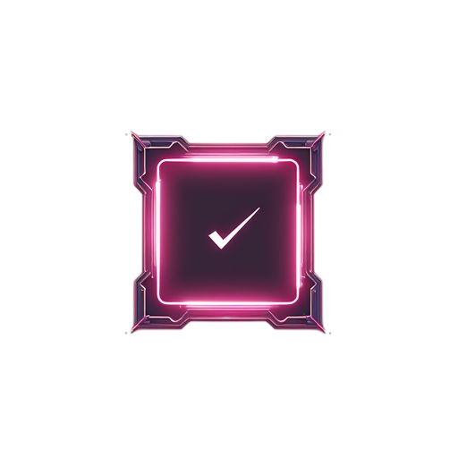
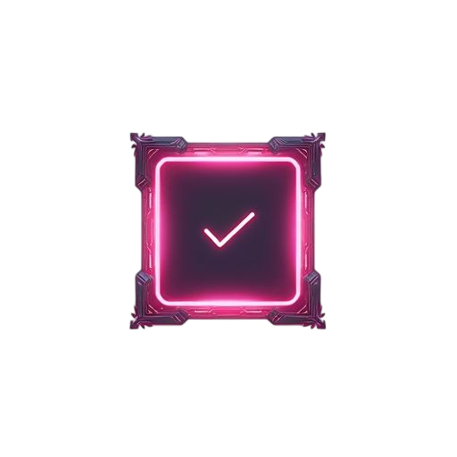
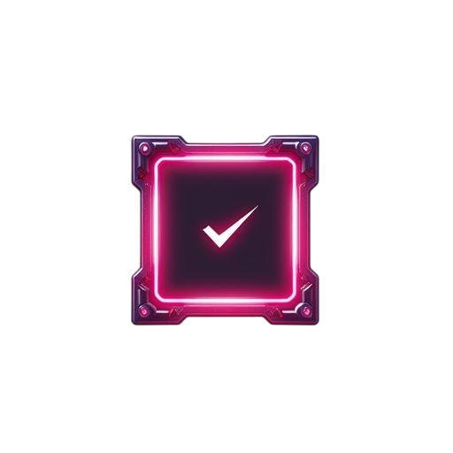
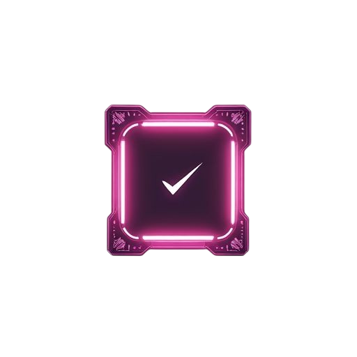
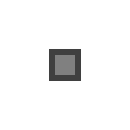
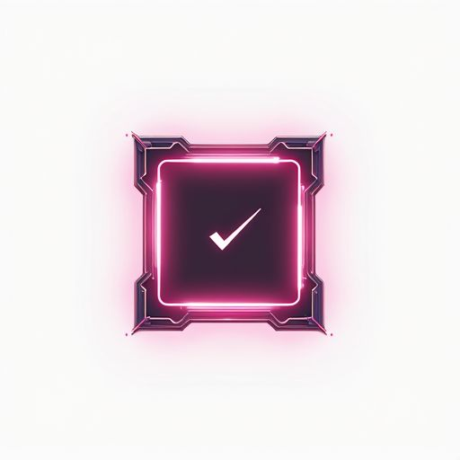
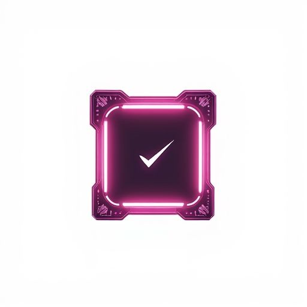
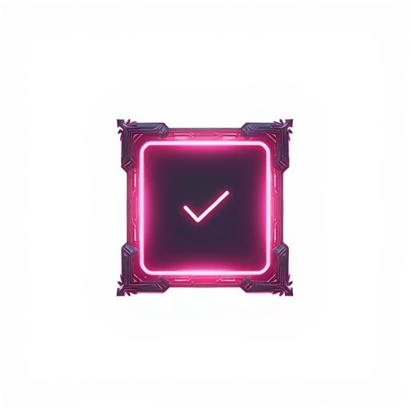
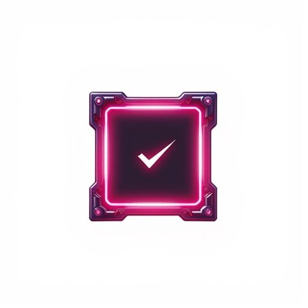

# UI Checkbox Generation Report

**Generated**: 1/25/2026, 10:18:11 AM  
**Theme**: cyberpunk neon with glowing edges and holographic effects  
**Component**: checkbox  
**States**: normal, hover, pressed, disabled  
**Resolution**: 256x256  
**Nine-Patch Margins**: 12px all sides

---

## Generation Summary

✅ **4/4 states generated successfully**

- ✅ normal
- ✅ hover
- ✅ pressed
- ✅ disabled

---

## Prompts

### Normal State

<details>
<summary><strong>Positive Prompt</strong> (319 chars)</summary>

```
A checkbox UI background for a game interface. Theme: cyberpunk neon with glowing edges and holographic effects. State: neutral, clean. Front view, flat 2D element with transparent background. Decorative borders and clean center area suitable for nine-patch scaling. Professional game UI style, functional and thematic.
```

</details>

<details>
<summary><strong>Negative Prompt</strong> (171 chars)</summary>

```
text, labels, icons, checkmarks, letters, numbers, watermark, signature, grid lines, measurement marks, multiple elements, 3D perspective, angled view, blurry, low quality
```

</details>

### Disabled State

<details>
<summary><strong>Positive Prompt</strong> (329 chars)</summary>

```
A checkbox UI background for a game interface. Theme: cyberpunk neon with glowing edges and holographic effects. State: greyed out, low contrast. Front view, flat 2D element with transparent background. Decorative borders and clean center area suitable for nine-patch scaling. Professional game UI style, functional and thematic.
```

</details>

<details>
<summary><strong>Negative Prompt</strong> (171 chars)</summary>

```
text, labels, icons, checkmarks, letters, numbers, watermark, signature, grid lines, measurement marks, multiple elements, 3D perspective, angled view, blurry, low quality
```

</details>

### Hover State

<details>
<summary><strong>Positive Prompt</strong> (335 chars)</summary>

```
A checkbox UI background for a game interface. Theme: cyberpunk neon with glowing edges and holographic effects. State: highlighted, slightly brighter. Front view, flat 2D element with transparent background. Decorative borders and clean center area suitable for nine-patch scaling. Professional game UI style, functional and thematic.
```

</details>

<details>
<summary><strong>Negative Prompt</strong> (171 chars)</summary>

```
text, labels, icons, checkmarks, letters, numbers, watermark, signature, grid lines, measurement marks, multiple elements, 3D perspective, angled view, blurry, low quality
```

</details>

### Pressed State

<details>
<summary><strong>Positive Prompt</strong> (331 chars)</summary>

```
A checkbox UI background for a game interface. Theme: cyberpunk neon with glowing edges and holographic effects. State: depressed, darker or inset. Front view, flat 2D element with transparent background. Decorative borders and clean center area suitable for nine-patch scaling. Professional game UI style, functional and thematic.
```

</details>

<details>
<summary><strong>Negative Prompt</strong> (171 chars)</summary>

```
text, labels, icons, checkmarks, letters, numbers, watermark, signature, grid lines, measurement marks, multiple elements, 3D perspective, angled view, blurry, low quality
```

</details>

---

## Generated Images

### Normal State



**File**: `ui-base-state_4-final-normal.png`

### Hover State



**File**: `ui-variation-states_4-final-hover.png`

### Pressed State



**File**: `ui-variation-states_4-final-pressed.png`

### Disabled State



**File**: `ui-variation-states_4-final-disabled.png`

---

## Intermediate Outputs

### Silhouette



### Before Background Removal

**normal**:  


**disabled**:  


**hover**:  


**pressed**:  


---

## Metadata

```json
{
  "componentType": "checkbox",
  "states": {
    "normal": {
      "r2Key": "generated/test-ui/checkbox/checkbox/normal.png",
      "publicUrl": "http://localhost:8787/assets/generated/test-ui/checkbox/checkbox/normal.png",
      "region": {
        "x": 0,
        "y": 0,
        "width": 256,
        "height": 256
      }
    },
    "hover": {
      "r2Key": "generated/test-ui/checkbox/checkbox/hover.png",
      "publicUrl": "http://localhost:8787/assets/generated/test-ui/checkbox/checkbox/hover.png",
      "region": {
        "x": 0,
        "y": 0,
        "width": 256,
        "height": 256
      }
    },
    "pressed": {
      "r2Key": "generated/test-ui/checkbox/checkbox/pressed.png",
      "publicUrl": "http://localhost:8787/assets/generated/test-ui/checkbox/checkbox/pressed.png",
      "region": {
        "x": 0,
        "y": 0,
        "width": 256,
        "height": 256
      }
    },
    "disabled": {
      "r2Key": "generated/test-ui/checkbox/checkbox/disabled.png",
      "publicUrl": "http://localhost:8787/assets/generated/test-ui/checkbox/checkbox/disabled.png",
      "region": {
        "x": 0,
        "y": 0,
        "width": 256,
        "height": 256
      }
    }
  },
  "ninePatchMargins": {
    "left": 12,
    "right": 12,
    "top": 12,
    "bottom": 12
  },
  "baseResolution": 256,
  "generatedAt": 1769365090317,
  "theme": "cyberpunk neon with glowing edges and holographic effects"
}
```

---

## R2 Storage

### Keys

- `generated/test-ui/checkbox/checkbox/normal.png`
- `generated/test-ui/checkbox/checkbox/hover.png`
- `generated/test-ui/checkbox/checkbox/pressed.png`
- `generated/test-ui/checkbox/checkbox/disabled.png`
- `generated/test-ui/checkbox/checkbox/metadata.json`

### Public URLs

- http://localhost:8787/assets/generated/test-ui/checkbox/checkbox/normal.png
- http://localhost:8787/assets/generated/test-ui/checkbox/checkbox/hover.png
- http://localhost:8787/assets/generated/test-ui/checkbox/checkbox/pressed.png
- http://localhost:8787/assets/generated/test-ui/checkbox/checkbox/disabled.png
- http://localhost:8787/assets/generated/test-ui/checkbox/checkbox/metadata.json

---

## File Listing

```
ui-base-state_1-silhouette.png
ui-base-state_2-prompt-normal.txt
ui-base-state_3-generated-normal.png
ui-base-state_4-final-normal.png
ui-upload-r2_metadata.json
ui-variation-states_2-prompt-disabled.txt
ui-variation-states_2-prompt-hover.txt
ui-variation-states_2-prompt-pressed.txt
ui-variation-states_3-generated-disabled.png
ui-variation-states_3-generated-hover.png
ui-variation-states_3-generated-pressed.png
ui-variation-states_4-final-disabled.png
ui-variation-states_4-final-hover.png
ui-variation-states_4-final-pressed.png
```
