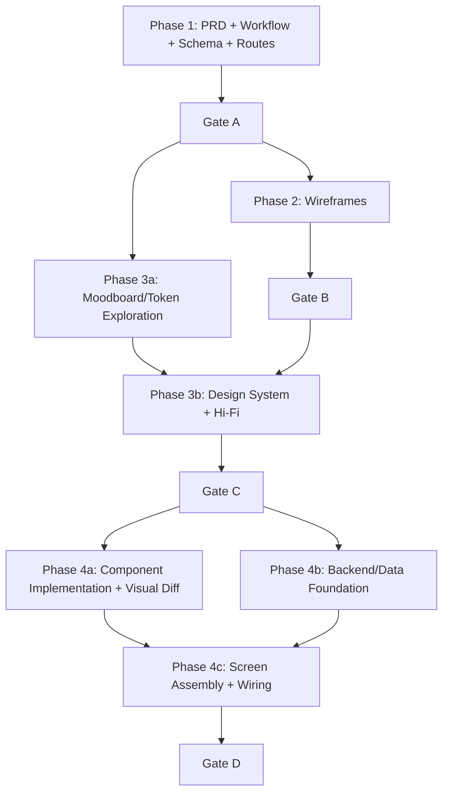

And I don't know, would it make sense to try to align the agent dispatch types to the actual providers in Sisyphus here and on my open code?# Agentic Company Operating Model (Slopcade)

## Purpose

This document defines how Slopcade operates as an agentic company: specialized agents, explicit handoffs, strict validation gates, and measurable outcomes from ideation to production.

It synthesizes:
- Internal lifecycle blueprint: `docs/architecture/agentic-app-lifecycle.md`
- External operating patterns distilled in: `docs/architecture/agent-patterns-research.md` (including agent-experience + ULW-oriented execution principles)

---

## Scope

This operating model governs:
- Multi-agent work decomposition and orchestration
- Artifact contracts between agent roles
- Validation gates and evidence required to pass
- Human-in-the-loop escalation points
- Reliability, observability, and cost controls

This model does **not** define:
- Low-level tool implementation details
- Single-feature coding conventions already covered by project docs
- Vendor-specific lock-in architecture

---

## Core Non-Negotiable Principles

1. **Role specialization over monolith agents**
   - Every agent has one primary responsibility and clear boundaries.
2. **Artifact-first handoffs**
   - No phase transition without explicit deliverables and acceptance checks.
3. **Validation before progression**
   - Gates are mandatory. Failing gate means rework, not bypass.
4. **Parallel by default, serialized by dependency**
   - Independent work runs concurrently; dependencies are explicit.
5. **Human oversight for consequential actions**
   - Financial, destructive, security-sensitive, or reputational actions require human approval.
6. **Evidence over assertion**
   - “Done” requires objective outputs, logs, tests, and gate pass evidence.
7. **Bounded autonomy**
   - Timeouts, budget caps, and escalation paths are required for all loops.

---

## Role Model and Decision Rights

| Role | Owns | Must Produce | Cannot Approve Alone |
|---|---|---|---|
| Product Manager Agent | Scope, outcomes, PRD | Prioritized PRD (P0/P1/P2), success criteria | Architecture gate |
| UX Researcher Agent | Personas, workflows, states | Journey maps, state matrix | Visual brand gate |
| Architect Agent | Data models, boundaries, routing strategy | Schemas, architecture spec, route matrix | Final UX/brand gate |
| Wireframe Designer Agent | Structural layout | Low-fi canvases per route and state | Engineering readiness gate |
| Visual/UI Designer Agent | Design system, hi-fi visuals | Tokens, component library, hi-fi screens | Production code readiness gate |
| Design Engineer Agent | Component/page implementation | Component code, stories, visual diffs | Data integrity/security gate |
| Full-stack Agent | Backend wiring and integration | APIs/routers, DB wiring, connected UI | Brand/UX gate |
| Human Reviewer(s) | Governance and risk controls | Gate decisions, exceptions, overrides | N/A |

---

## Lifecycle with Operating Rules

### Phase 1 — Exploration & Definition (Strategy)
**Inputs:** Raw idea, domain context  
**Outputs:** PRD, personas/workflows, schemas, route taxonomy

**Must:**
- Define success criteria before execution.
- Capture all user-facing states: loading, empty, error, success.
- Produce explicit server/client boundary decisions.

**Gate A (Architecture Review):**
- Every PRD requirement maps to schema + workflow + route.
- No unresolved domain ambiguity for P0 scope.

---

### Phase 2 — Structural Design (Bones)
**Inputs:** Workflows + routes  
**Outputs:** Wireframes for all critical routes/states

**Must:**
- Keep wireframes style-neutral (layout only).
- Include CTA placement and state-specific layout variants.

**Gate B (UX Structure Review):**
- Error/empty/loading states present on all key journeys.
- Primary actions are discoverable and reachable.

---

### Phase 3 — Visual Identity & Systems (Vibe)
**Inputs:** Wireframes + audience goals  
**Outputs:** Tokens, component library, hi-fi screens

**Must:**
- Build reusable visual primitives before screen polish.
- Validate accessibility contrast and typography hierarchy.

**Gate C (Brand + Accessibility Review):**
- Visual language matches intended audience.
- Accessibility checks pass agreed threshold.

---

### Phase 4 — Engineering Implementation (Flesh)
**Inputs:** Hi-fi designs + schemas + route contracts  
**Outputs:** Working app with coded components, screens, backend wiring

**Must:**
- Maintain 1:1 component mapping between design system and implementation.
- Run visual diff loop for critical UI components/screens.
- Enforce deterministic checks (tests/schema/type/build) before merge.

**Gate D (Visual + Functional Verification):**
- Visual similarity threshold achieved for critical components.
- Typecheck/tests/build pass for integrated features.

---

## Parallel Work Graph (Default Execution Pattern)

Parallelism policy:
- Run independent tracks concurrently (e.g., moodboard exploration while wireframes are finalized).
- Do not parallelize work with unresolved upstream contracts.
- If a gate fails, only re-open impacted branches.

---

## Handoff Contract (Required Schema)

Every handoff must include:
1. **Intent**: what outcome this artifact enables
2. **Inputs consumed**: source docs/artifacts versions
3. **Output artifact(s)**: links/paths and structured payloads
4. **Acceptance checks**: pass/fail checks already run
5. **Known risks**: unresolved ambiguity and expected impact
6. **Next agent instructions**: exact downstream contract

A handoff is rejected if any of these are missing.

---

## Reliability and Safety Controls

### Agent runtime controls
- Timeout per task and per phase
- Retry with bounded backoff
- Circuit breaker for repeated failures
- Idempotent operations where feasible

### Guardrails
- Input validation before agent invocation
- Structured output validation before downstream consumption
- Tool-level permission boundaries (least privilege)
- Budget caps (token/cost/time)

### Human-in-the-loop triggers
Require human approval when action is:
- Destructive (delete/reset/write-prod)
- Financial/billing related
- Security/privacy sensitive
- Publicly visible/reputational

---

## Verification Model

Use dual verification:
1. **Deterministic checks**: schema/type/tests/build
2. **Agentic critique loops**: draft → critique → revise (bounded iterations)

Stop criteria for critique loops:
- Quality improves across iterations, max 2-3 passes
- If quality plateaus/fails twice, escalate (human or specialist agent)

---

## Observability and Metrics

Track these baseline metrics across the company pipeline:
- Phase lead time (per phase and end-to-end)
- Gate failure rate by gate and reason
- Handoff rejection rate
- Rework ratio (% work reopened after gate/handoff)
- Cost per completed initiative (token/tool/runtime)
- Escalation frequency (human and specialist-agent)
- Reliability indicators (timeouts/retries/circuit breaks)

Minimum telemetry for each task:
- task id, role, inputs, outputs, tool calls, duration, cost, final status

---

## Anti-Patterns (Do Not Allow)

- Single giant agent with no clear boundaries
- Implicit state only in context windows (no explicit artifacts)
- Skipping gates to “move fast”
- No cancel/escalation path for long-running agents
- Non-structured handoffs (“read this paragraph and continue”)
- Unbounded reflection loops or parallel fan-out without budget control

---

## Adoption Playbook (Rollout)

1. **Pilot (1–2 workflows)**
   - Choose one product flow and one support/internal flow.
2. **Instrument first**
   - Capture baseline metrics before optimization.
3. **Enforce gates and handoff schema**
   - No bypass exceptions during pilot.
4. **Tighten contracts by failure data**
   - Use gate/handoff failure reasons to refine templates.
5. **Scale with role-specific agent libraries**
   - Reuse prompts, checklists, and validators by role.

---

## Open Questions (Decision Backlog)

1. What exact visual diff threshold applies to each product surface (98% global or route-specific thresholds)?
2. Which production actions are permanently human-gated vs conditionally gated?
3. What is the canonical schema for “artifact metadata” across all roles?
4. Which metrics are immediately collectible vs requiring new instrumentation?
5. How should exception handling be logged and audited over time?

---

## Definition of Done for This Operating Model

This document is considered operational when:
- It is used as the required template for at least one real end-to-end project.
- Each gate has explicit reviewer ownership.
- Handoff schema is enforced in practice.
- Baseline metrics are captured for one complete lifecycle.
